# MORI 이미지 제작 시트

컨셉·규격의 근거는 `MORI_상황별_캐릭터_설계.md`를 따른다. 이 문서는 실제 생성 작업용으로, 항목마다 **설명 → 프롬프트 → 이미지** 순서로 정리했다.

## 사용 방법

1. 항목을 위에서부터 순서대로 진행한다. 0번(모델 기준표)이 확정되기 전에는 뒤 항목을 진행하지 않는다.
2. 각 항목의 "프롬프트" 코드 블록을 그대로 복사해 이미지 생성기에 붙여넣는다.
3. 1번(observing) 이후 항목은 모두 **직전에 확정한 observing 흉상 이미지를 참조 이미지로 첨부**해야 한다. 프롬프트 텍스트만으로는 동일 인물이 유지되지 않는다.
4. 생성된 이미지를 확정하면 "이미지" 항목의 안내 주석을 지우고 `` 형태로 이미지를 삽입하거나, 지정된 경로에 파일을 저장한다.
5. 네거티브 프롬프트는 각 항목의 프롬프트 코드블록 안에 `Avoid: ...`로 이미 포함돼 있다. 코드블록을 통째로 복사하면 되고, 별도로 다시 넣을 필요 없다. (Stable Diffusion처럼 negative 입력란이 따로 있는 도구를 쓴다면, 문서 맨 아래 "공통 네거티브 프롬프트"를 그 칸에 추가로 넣어도 되지만 필수는 아니다.)
6. 프롬프트를 아무리 강화해도 **투명 배경**과 **머리핀 모양(`]` 브래킷)**이 계속 틀리게 나올 수 있다. 이는 문구 문제가 아니라 생성기 자체의 한계일 가능성이 높다. 이 경우 아래 "생성기 한계와 수동 보정" 절차를 따른다.

## 생성기 한계와 수동 보정

배경은 이제 **투명 알파만 허용**한다. 균일한 단색으로 대체하는 것도 더 이상 허용하지 않는다 — 이전에 "단색이면 됨"이라고 열어뒀다가 생성기가 검정을 골랐고, MORI 머리·선화가 거의 검정이라 나중에 배경을 지울 수 없는 문제가 생겼기 때문이다.

다음 문제들은 텍스트 프롬프트만으로 안정적으로 통제되지 않을 수 있다.

- **투명 배경이 안 나오고 아무 색이든 채워져서 나온다.** 이 경우 그 이미지는 그대로 쓰지 않는다. 특히 검정·회색 등 캐릭터 팔레트와 가까운 색이면 나중에 배경을 지울 때 머리카락에 구멍이 뚫릴 수 있어 위험하다. 재생성한다.
- **머리핀 모양**(double-bar나 barrette로 돌아감): 재생성하거나, 확정 후보를 골라 수동으로 `]` 모양을 다시 그린다.
- **정사각형(1600×1600) 대신 참조 이미지의 세로 2:3 비율을 그대로 따라온다**: 참조 이미지를 첨부해 편집하는 방식 자체가 입력 이미지의 캔버스 비율을 우선하는 도구 특성일 가능성이 높다. 이 경우 저장할 때 콘텐츠 바운딩 박스 기준으로 정사각형 크롭을 적용한다.

수동 보정이 필요할 때:

1. 표정·소품·구도가 마음에 들고, 배경이 실제로 투명하거나(알파 채널 있음) 최소한 배경이 캐릭터 팔레트와 뚜렷이 대비되는 후보를 고른다. 검정/회색 배경 후보는 애초에 고르지 않는다.
2. Photopea, Krita, Affinity Photo 등에서 배경을 확인·정리하고 알파 채널로 만든다.
3. 머리핀처럼 작은 고정 요소는 해당 부분만 직접 지우고 `]` 브래킷 모양으로 다시 그리거나 붙여 넣는다.
4. 이렇게 수동 보정된 파일을 최종본으로 저장하고, 이후 모든 참조·편집의 기준 원본으로 사용한다.
5. 특히 1번(observing)은 이후 10여 장의 기준이 되므로, 반드시 실제 투명 배경을 확인한 뒤에 확정한다.

진행 상태 체크:

- [x] 0. 모델 기준표
- [x] 1. observing (기준 흉상) — 표정이 설계보다 웃음이 조금 큼, 사용 가능 판단
- [x] 2. answer-correct
- [x] 3. sync-linked
- [x] 4. directive-complete — 재생성본(`_remake`) 채택
- [x] 5. sync-recovery — 재생성본(`_remake`) 채택
- [x] 6. answer-wrong
- [x] 7. deep-verify
- [x] 8. time-critical — 표정이 긴장감보다 미소에 가까움, 사용 가능 판단
- [x] 9. core-final
- [x] 10. result-verified
- [x] 11. result-unstable — 재생성본(`_remake`) 채택, 눈매는 확실히 피곤해졌으나 뺨의 잔머리 한 가닥은 기존 헤어 실루엣과 구분이 애매함
- [x] 12. boot-empty
- [x] 13. return-found
- [x] 14. lens-used — 카드 외에 연필도 같이 들려 있음, 핵심 요소(amber 사선 마크)는 충족해 채택
- [x] 15. tab-left
- [x] 16. other-self
- [x] 17. archive-complete — 재생성본(`_remake`) 채택, cyan 탭 6개 정확히 확인

17개 상태(모델 기준표 + 흉상 16종) 전부 완료.

---

## 0. 모델 기준표

**파일명**: `mori_model_v01.png` · **저장 경로**: `images/master/mori_model_v01.png`

### 설명

MORI의 전신 3/4 포즈 기준 이미지. 로컬 세션 검증 데몬 컨셉(검은 일지 톤 + cyan 색인선 + amber 보존 포인트)을 확정하는 이미지이며, 이후 모든 흉상 편집의 유일한 기준 원본이 된다. 후보는 최대 3장까지만 생성하고, 얼굴보다 실루엣·머리핀·포켓·신발이 설계와 일치하는 후보를 고른다.

### 프롬프트

```text
This is a technical reference asset for a game production pipeline, not promotional artwork. Precision and consistency matter more than beauty. If any requirement below is difficult to satisfy at the same time, prioritize in this exact order: (1) the hairpin shape, (2) a clean, flat, non-gradient background, (3) the exact color palette, (4) the pose and composition, (5) overall rendering polish.

Create a production character model image for an original adult woman named MORI, the local memory archivist daemon in the web game STATE//LESS. She is clearly in her early twenties. This is a restrained character design sheet image, not splash art and not a promotional poster.

Art direction: hand-inked 2D animation key drawing combined with a limited-color editorial archive print. Use confident but slightly irregular human linework, 2–4 px line-weight variation at 2048 px width, flat colors, one hard cel-shadow shape, and almost no soft gradients. Keep details intentionally economical. Avoid perfect facial symmetry and avoid glossy rendering.

Silhouette: relaxed three-quarter standing pose with weight on one leg; uneven layered black hair from jaw to shoulder, with one longer lock beside the right side of her face.

Hairpin geometry, described precisely: a single small solid amber shape that reads exactly like the punctuation mark "]" — one short vertical bar with two short perpendicular bars at its top and bottom ends, forming one connected hook/bracket outline. This is NOT two separate parallel horizontal bars stacked on top of each other, NOT a barrette, NOT a hair clip made of two independent stripes. There is exactly one hairpin, one solid connected shape, always on the same side of the head.

Face: narrow calm eyes, natural low eyebrows, a very subtle tired shadow under the eyes, and a restrained mischievous half-smile. Adult facial proportions, not childlike.

Clothing: paper-white high-neck inner shirt, oversized ink-charcoal archive work cardigan with two flat index-card pockets, high-waisted charcoal wide trousers, low practical leather work shoes. Add only one thin cyan binding-thread detail on one edge, and exactly one amber visible repair stitch on only one pocket. Do not mirror the stitch onto the other pocket and do not duplicate it anywhere else. No glowing circuits and no tactical equipment.

Prop: one blank warm-white index card with no writing, logo, symbol, or pseudo-text.

Palette must stay close to #020617, #0f172a, #1e293b, #e2e8f0, #f1f5f9, #67e8f9, and #fcd34d.

Background, two-tier requirement: first choice is a true transparent alpha channel with literally nothing rendered behind the character. If transparent alpha output is not supported, fall back to one single flat, perfectly uniform medium slate-gray-blue color instead, approximately #4B5563, evenly lit across the entire background with zero variation. Never use black, near-black, or white — those are too close to the character's own hair and clothing tones to separate later. Under no circumstance produce a vignette, radial glow, soft gradient, spotlight, floor plane, cast shadow, contact shadow, or reflection behind her — a flat uniform color is always acceptable, a gradient or vignette is never acceptable.

Export as RGBA, sRGB. Full body from hair to shoes, 2:3 vertical canvas, 8–10 percent empty margin, one character only.

STRICT REQUIREMENTS — do not violate any of these:
- Exactly one hairpin, shaped like "]" as described above, never a double-bar or barrette shape.
- Exactly one amber repair stitch, on one pocket only, never mirrored or duplicated.
- Background is either true transparent alpha, or one flat uniform medium slate-gray-blue (#4B5563). Never black, near-black, white, a gradient, a vignette, or a radial glow. Never a floor or shadow.
- One character only, full body, hair to shoes visible, no cropping.

Avoid: generic cyberpunk girl, neon circuit hoodie, hologram, tactical straps, school uniform, childlike body, huge glossy eyes, plastic skin, airbrushed face, photorealism, 3D render, painterly splash art, excessive hair strands, excessive clothing folds, rim light, bloom, random jewelry, multiple hair clips, double-bar hairpin, two parallel bars, barrette, symmetric hairpin, mirrored stitch, duplicated stitch, two-sided accessory, asymmetrical accessory changes, unreadable text, pseudo-lettering, logo, watermark, background scene, vignette, radial glow background, gradient backdrop, spotlight, drop shadow, cast shadow, contact shadow, floor plane, reflection, black background, pure black backdrop, near-black backdrop, white background, gray background, solid color background, opaque background, colored backdrop, flat color background, tall portrait canvas, 2:3 aspect ratio, non-square canvas, cropped feet, extra fingers, merged fingers, broken hands, duplicate props.
```

**0번을 다시 생성해야 할 경우**(고해상도 재생성 등): 위 텍스트의 머리핀 묘사("]" 모양)는 참고용일 뿐, 실제 기준은 아래 확정된 `mori_model_v01.png`다. 재생성 시 이 파일을 참조 이미지로 첨부하고 "머리핀 모양·색·크기·위치를 참조 이미지와 픽셀 단위로 동일하게 유지" 문장을 프롬프트에 추가한다.

### 이미지

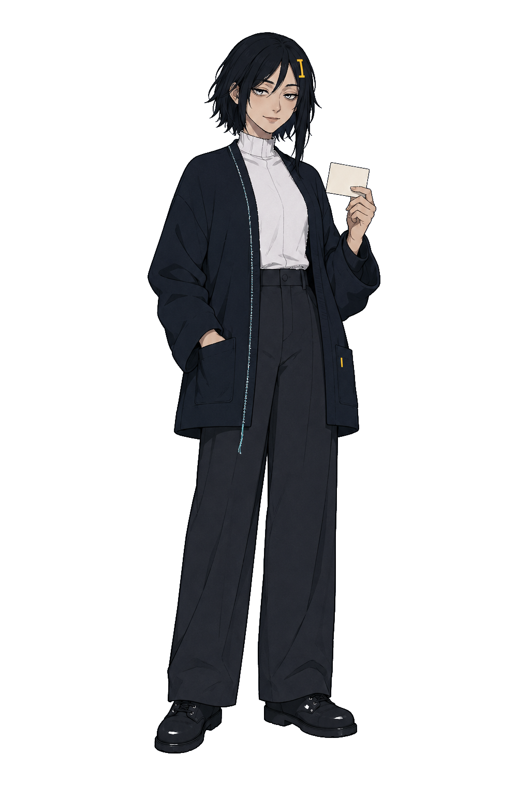

균일한 단색 배경을 스크립트로 알파 처리해 저장함(1024×1536, RGBA). 권장 해상도(2048×3072)보다는 낮지만 최소 규격은 충족. 머리핀은 "]" 훅이 아니라 세로 막대에 가깝지만, 이번 결과를 새 기준으로 고정하고 이후 모든 흉상에서 이 형태를 그대로 유지한다.

---

## 1. observing (기준 흉상)

**파일명**: `mori_observing.webp` · **저장 경로**: `images/states/mori_observing.webp`

### 설명

문제 풀이 중 상태. 교정 연필을 가볍게 든 중립 집중 표정. 강조색 cyan. 이후 모든 상황별 흉상 편집의 직접 원본이 되는 첫 흉상이므로, 여기서 확정한 얼굴·머리핀·의상·색상·크롭이 나머지 10장에 그대로 고정된다.

### 프롬프트

```text
This is a technical reference asset for a game production pipeline, not promotional artwork. Precision and consistency matter more than beauty. If any requirement below is difficult to satisfy at the same time, prioritize in this exact order: (1) the hairpin shape, (2) a clean, flat, non-gradient background, (3) identical facial proportions to the reference, (4) the requested pose and prop, (5) overall rendering polish.

Use the attached approved MORI model as a locked character reference. Create one square chest-up production portrait for the in-game state slot. Preserve the exact facial proportions, eye spacing, nose, mouth, jaw, hair contour, palette, line weight, and shadow direction. Do not redesign, beautify, or restyle her.

Hairpin: copy the exact shape, size, color, and position of the hairpin already visible in the attached reference image, pixel for pixel. Do not reinterpret it, redesign it, or revert to any other hairpin shape — whatever shape is in the reference is the only correct shape. Exactly one hairpin.

MORI is quietly observing a browser memory audit. Her mouth is neutral with the faintest one-sided amusement. She holds one rose correction pencil loosely near the bottom edge.

Canvas: the output MUST be a square 1:1 canvas, 1600x1600. The reference image is a tall 2:3 portrait — do NOT copy its aspect ratio. Recompose the chest-up crop specifically to fit a square frame; this is a deliberate reframing of aspect ratio only, while everything else (face, hairpin, palette, line art) stays identical to the reference.

Background: the attached reference image has a true transparent background (a real alpha channel, nothing rendered behind her). The output must match that exactly — a true transparent alpha channel, RGBA, with absolutely nothing rendered behind her. No backdrop color of any kind, no black, no white, no gray, no gradient, no vignette, no spotlight, no floor, no shadow, no reflection. This is not optional and has no fallback color.

Keep the face center and shoulder crop suitable for identical overlay with future expression edits.

STRICT REQUIREMENTS — do not violate any of these:
- Exactly one hairpin, copied pixel-for-pixel from the reference image's shape, size, color, and position. Do not redesign it into any other shape.
- Canvas is square 1:1, 1600x1600 — NOT the reference's tall 2:3 shape. Reframe to fit, do not letterbox or pad to fake a square.
- Background MUST be true transparent alpha, matching the reference. No fallback solid color of any kind — not black, not gray, not white.
- Only the expression and the one described hand/prop may change from the reference.

Avoid: generic cyberpunk girl, neon circuit hoodie, hologram, tactical straps, school uniform, childlike body, huge glossy eyes, plastic skin, airbrushed face, photorealism, 3D render, painterly splash art, excessive hair strands, excessive clothing folds, rim light, bloom, random jewelry, multiple hair clips, double-bar hairpin, two parallel bars, barrette, symmetric hairpin, mirrored stitch, duplicated stitch, two-sided accessory, asymmetrical accessory changes, unreadable text, pseudo-lettering, logo, watermark, background scene, vignette, radial glow background, gradient backdrop, spotlight, drop shadow, cast shadow, contact shadow, floor plane, reflection, black background, pure black backdrop, near-black backdrop, white background, gray background, solid color background, opaque background, colored backdrop, flat color background, tall portrait canvas, 2:3 aspect ratio, non-square canvas, cropped feet, extra fingers, merged fingers, broken hands, duplicate props.
```

첨부: 0번에서 확정한 모델 기준표.

### 이미지


투명 배경·정사각형 확인됨. 다만 "옅은 미소" 대신 표정이 조금 뚜렷하고, 연필을 아래쪽에 느슨히 든 게 아니라 살짝 앞으로 내미는 포즈다. 이후 10장의 기준 원본이 되니, 표정이 너무 밝다고 느끼면 이 이미지로 재시도하는 걸 권장.

---

## 2. answer-correct

**파일명**: `mori_answer-correct.webp` · **저장 경로**: `images/states/mori_answer-correct.webp`

### 설명

정답 상태. 한쪽 입꼬리가 올라가고 작은 검수 카드를 제시한다. 강조색 emerald.

### 프롬프트

```text
Edit the attached locked MORI portrait. This is a masked production edit, not a new illustration — do not regenerate the whole image. Preserve all unmasked pixels exactly as they are, including the background, the hairpin shape and color, and every clothing detail. Keep the exact face landmarks, head angle, hair silhouette, the hairpin's exact shape and position as shown in the reference, clothing outline, line art, palette, crop, canvas size, framing, and lighting identical to the reference — do not reframe, rotate, zoom, or resize. The reference is a square 1:1 canvas; the output must stay square 1:1 too, never a tall 2:3 portrait. Change only the requested expression, hand gesture, and the single prop described below, and nothing else. Do not add new details, accessories, or polish beyond the reference.

Her mischievous half-smile becomes slightly clearer. She presents one small card bearing only a simple emerald check mark.

Background: the reference image has a true transparent background (a real alpha channel). Preserve it exactly — every background pixel stays transparent alpha, with nothing rendered behind her. This has no fallback color: not black, not gray, not white, not a gradient, not a vignette, not a spotlight, not a floor, not a shadow, not a reflection. No text, logo, UI, or scenery either.

STRICT REQUIREMENTS — do not violate any of these:
- Background MUST be true transparent alpha, identical to the reference. No fallback solid color of any kind — not black, not gray, not white.
- Hairpin copied pixel-for-pixel from the reference: same shape, size, color, and position. Do not redesign it into a different shape.
- Canvas stays square 1:1, identical size to the reference — never reverts to a tall 2:3 portrait.
- Only the described expression, hand gesture, and single prop change. Every other pixel — face, hair, clothing, stitch, pocket, crop — stays identical to the reference.
- No reframing, rotation, zoom, or canvas resize.

Avoid: generic cyberpunk girl, neon circuit hoodie, hologram, tactical straps, school uniform, childlike body, huge glossy eyes, plastic skin, airbrushed face, photorealism, 3D render, painterly splash art, excessive hair strands, excessive clothing folds, rim light, bloom, random jewelry, multiple hair clips, double-bar hairpin, two parallel bars, barrette, symmetric hairpin, mirrored stitch, duplicated stitch, two-sided accessory, asymmetrical accessory changes, unreadable text, pseudo-lettering, logo, watermark, background scene, vignette, radial glow background, gradient backdrop, spotlight, drop shadow, cast shadow, contact shadow, floor plane, reflection, black background, pure black backdrop, near-black backdrop, white background, gray background, solid color background, opaque background, colored backdrop, flat color background, tall portrait canvas, 2:3 aspect ratio, non-square canvas, cropped feet, extra fingers, merged fingers, broken hands, duplicate props.
```

첨부: 1번 observing 흉상.

### 이미지

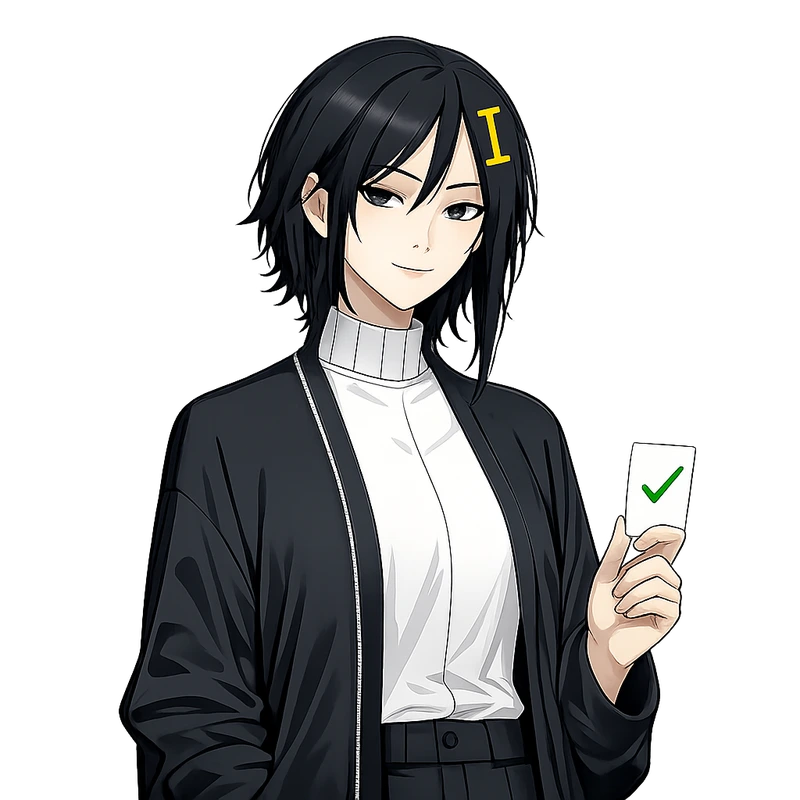

투명 배경·정사각형 확인됨. 초록 체크마크 카드, 설계와 일치.

---

## 3. sync-linked

**파일명**: `mori_sync-linked.webp` · **저장 경로**: `images/states/mori_sync-linked.webp`

### 설명

2연속 이상 정답 상태. 장난기가 조금 더 드러난 미소로 cyan 조각을 플레이어 쪽으로 기울인다. 강조색 emerald + cyan.

### 프롬프트

```text
Edit the attached locked MORI portrait. This is a masked production edit, not a new illustration — do not regenerate the whole image. Preserve all unmasked pixels exactly as they are, including the background, the hairpin shape and color, and every clothing detail. Keep the exact face landmarks, head angle, hair silhouette, the hairpin's exact shape and position as shown in the reference, clothing outline, line art, palette, crop, canvas size, framing, and lighting identical to the reference — do not reframe, rotate, zoom, or resize. The reference is a square 1:1 canvas; the output must stay square 1:1 too, never a tall 2:3 portrait. Change only the requested expression, hand gesture, and the single prop described below, and nothing else. Do not add new details, accessories, or polish beyond the reference.

Her restrained smile opens only slightly and her shoulders lean a few degrees toward the viewer. She tilts one small translucent cyan memory shard toward the viewer as if both are reading the same record.

Background: the reference image has a true transparent background (a real alpha channel). Preserve it exactly — every background pixel stays transparent alpha, with nothing rendered behind her. This has no fallback color: not black, not gray, not white, not a gradient, not a vignette, not a spotlight, not a floor, not a shadow, not a reflection. No text, logo, UI, or scenery either.

STRICT REQUIREMENTS — do not violate any of these:
- Background MUST be true transparent alpha, identical to the reference. No fallback solid color of any kind — not black, not gray, not white.
- Hairpin copied pixel-for-pixel from the reference: same shape, size, color, and position. Do not redesign it into a different shape.
- Canvas stays square 1:1, identical size to the reference — never reverts to a tall 2:3 portrait.
- Only the described expression, hand gesture, and single prop change. Every other pixel — face, hair, clothing, stitch, pocket, crop — stays identical to the reference.
- No reframing, rotation, zoom, or canvas resize.

Avoid: generic cyberpunk girl, neon circuit hoodie, hologram, tactical straps, school uniform, childlike body, huge glossy eyes, plastic skin, airbrushed face, photorealism, 3D render, painterly splash art, excessive hair strands, excessive clothing folds, rim light, bloom, random jewelry, multiple hair clips, double-bar hairpin, two parallel bars, barrette, symmetric hairpin, mirrored stitch, duplicated stitch, two-sided accessory, asymmetrical accessory changes, unreadable text, pseudo-lettering, logo, watermark, background scene, vignette, radial glow background, gradient backdrop, spotlight, drop shadow, cast shadow, contact shadow, floor plane, reflection, black background, pure black backdrop, near-black backdrop, white background, gray background, solid color background, opaque background, colored backdrop, flat color background, tall portrait canvas, 2:3 aspect ratio, non-square canvas, cropped feet, extra fingers, merged fingers, broken hands, duplicate props.
```

첨부: 1번 observing 흉상.

### 이미지

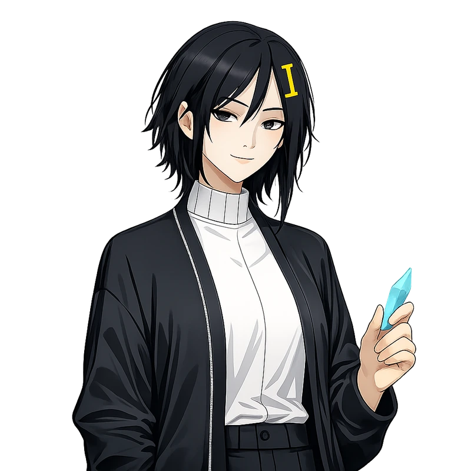

투명 배경·정사각형 확인됨. cyan 조각을 들어 보이는 구도, 설계와 일치.

---

## 4. directive-complete

**파일명**: `mori_directive-complete.webp` · **저장 경로**: `images/states/mori_directive-complete.webp`

### 설명

`MORI REQUEST` 완료 상태. 약속한 보너스 카드를 일지에 봉인하는 만족스러운 반쪽 미소. 강조색 emerald + amber.

### 프롬프트

```text
Edit the attached locked MORI portrait. This is a masked production edit, not a new illustration — do not regenerate the whole image. Preserve all unmasked pixels exactly as they are, including the background, the hairpin shape and color, and every clothing detail. Keep the exact face landmarks, head angle, hair silhouette, the hairpin's exact shape and position as shown in the reference, clothing outline, line art, palette, crop, canvas size, framing, and lighting identical to the reference — do not reframe, rotate, zoom, or resize. The reference is a square 1:1 canvas; the output must stay square 1:1 too, never a tall 2:3 portrait. Change only the requested expression, hand gesture, and the single prop described below, and nothing else. Do not add new details, accessories, or polish beyond the reference.

She seals the promised bonus card into one charcoal archive ledger. On the visible face of the card there MUST be one clearly rendered bright emerald green (#6EE7B7) check mark — a simple "✓" shape, large enough to read easily, high-contrast against the card. There is also one amber binding tab. Her restrained half-smile shows quiet satisfaction, as if a pact has been honored. No writing or extra symbol.

Background: the reference image has a true transparent background (a real alpha channel). Preserve it exactly — every background pixel stays transparent alpha, with nothing rendered behind her. This has no fallback color: not black, not gray, not white, not a gradient, not a vignette, not a spotlight, not a floor, not a shadow, not a reflection. No text, logo, UI, or scenery either.

STRICT REQUIREMENTS — do not violate any of these:
- The emerald green (#6EE7B7) check mark on the card is the single most important element of this image. It must be clearly visible. A card with only an amber tab and no visible emerald check mark is a failed generation — regenerate rather than accept it.
- Background MUST be true transparent alpha, identical to the reference. No fallback solid color of any kind — not black, not gray, not white.
- Hairpin copied pixel-for-pixel from the reference: same shape, size, color, and position. Do not redesign it into a different shape.
- Canvas stays square 1:1, identical size to the reference — never reverts to a tall 2:3 portrait.
- Only the described expression, hand gesture, and single prop change. Every other pixel — face, hair, clothing, stitch, pocket, crop — stays identical to the reference.
- No reframing, rotation, zoom, or canvas resize.

Avoid: generic cyberpunk girl, neon circuit hoodie, hologram, tactical straps, school uniform, childlike body, huge glossy eyes, plastic skin, airbrushed face, photorealism, 3D render, painterly splash art, excessive hair strands, excessive clothing folds, rim light, bloom, random jewelry, multiple hair clips, double-bar hairpin, two parallel bars, barrette, symmetric hairpin, mirrored stitch, duplicated stitch, two-sided accessory, asymmetrical accessory changes, unreadable text, pseudo-lettering, logo, watermark, background scene, vignette, radial glow background, gradient backdrop, spotlight, drop shadow, cast shadow, contact shadow, floor plane, reflection, black background, pure black backdrop, near-black backdrop, white background, gray background, solid color background, opaque background, colored backdrop, flat color background, tall portrait canvas, 2:3 aspect ratio, non-square canvas, card with no check mark, amber-only card, missing emerald mark, cropped feet, extra fingers, merged fingers, broken hands, duplicate props.
```

첨부: 1번 observing 흉상.

### 이미지


재생성본(`_remake`) 채택. 검은 일지에 emerald 체크마크가 뚜렷하게 보이고 amber 탭 두 곳(위·측면)도 명확함. 투명 배경·정사각형 확인됨.

---

## 5. sync-recovery

**파일명**: `mori_sync-recovery.webp` · **저장 경로**: `images/states/mori_sync-recovery.webp`

### 설명

실수 뒤 3연속 정답 상태. 다친 색인 카드를 펴고 emerald 실로 다시 묶어 플레이어에게 돌려준다. 강조색 emerald + amber.

### 프롬프트

```text
Edit the attached locked MORI portrait. This is a masked production edit, not a new illustration — do not regenerate the whole image. Preserve all unmasked pixels exactly as they are, including the background, the hairpin shape and color, and every clothing detail. Keep the exact face landmarks, head angle, hair silhouette, the hairpin's exact shape and position as shown in the reference, clothing outline, line art, palette, crop, canvas size, framing, and lighting identical to the reference — do not reframe, rotate, zoom, or resize. The reference is a square 1:1 canvas; the output must stay square 1:1 too, never a tall 2:3 portrait. Change only the requested expression, hand gesture, and the single prop described below, and nothing else. Do not add new details, accessories, or polish beyond the reference.

She carefully smooths one previously creased index card. Across the crease there MUST be one clearly rendered bright emerald green (#6EE7B7) stitch line — like a simple hand-sewn seam of 3-4 short stitches reconnecting the two halves of the card, high-contrast and easy to read, not a subtle or faint detail. She returns the repaired card toward the viewer with a relieved but restrained smile. Add one small amber recovery tab, no text.

Background: the reference image has a true transparent background (a real alpha channel). Preserve it exactly — every background pixel stays transparent alpha, with nothing rendered behind her. This has no fallback color: not black, not gray, not white, not a gradient, not a vignette, not a spotlight, not a floor, not a shadow, not a reflection. No text, logo, UI, or scenery either.

STRICT REQUIREMENTS — do not violate any of these:
- The emerald green (#6EE7B7) stitch line across the card's crease is the single most important element of this image. It must be clearly visible. A card with only an amber tab and no visible emerald stitch is a failed generation — regenerate rather than accept it.
- Background MUST be true transparent alpha, identical to the reference. No fallback solid color of any kind — not black, not gray, not white.
- Hairpin copied pixel-for-pixel from the reference: same shape, size, color, and position. Do not redesign it into a different shape.
- Canvas stays square 1:1, identical size to the reference — never reverts to a tall 2:3 portrait.
- Only the described expression, hand gesture, and single prop change. Every other pixel — face, hair, clothing, stitch, pocket, crop — stays identical to the reference.
- No reframing, rotation, zoom, or canvas resize.

Avoid: generic cyberpunk girl, neon circuit hoodie, hologram, tactical straps, school uniform, childlike body, huge glossy eyes, plastic skin, airbrushed face, photorealism, 3D render, painterly splash art, excessive hair strands, excessive clothing folds, rim light, bloom, random jewelry, multiple hair clips, double-bar hairpin, two parallel bars, barrette, symmetric hairpin, mirrored stitch, duplicated stitch, two-sided accessory, asymmetrical accessory changes, unreadable text, pseudo-lettering, logo, watermark, background scene, vignette, radial glow background, gradient backdrop, spotlight, drop shadow, cast shadow, contact shadow, floor plane, reflection, black background, pure black backdrop, near-black backdrop, white background, gray background, solid color background, opaque background, colored backdrop, flat color background, tall portrait canvas, 2:3 aspect ratio, non-square canvas, card with no stitch, amber-only card, missing emerald stitch, blank uncreased card, cropped feet, extra fingers, merged fingers, broken hands, duplicate props.
```

첨부: 1번 observing 흉상.

### 이미지

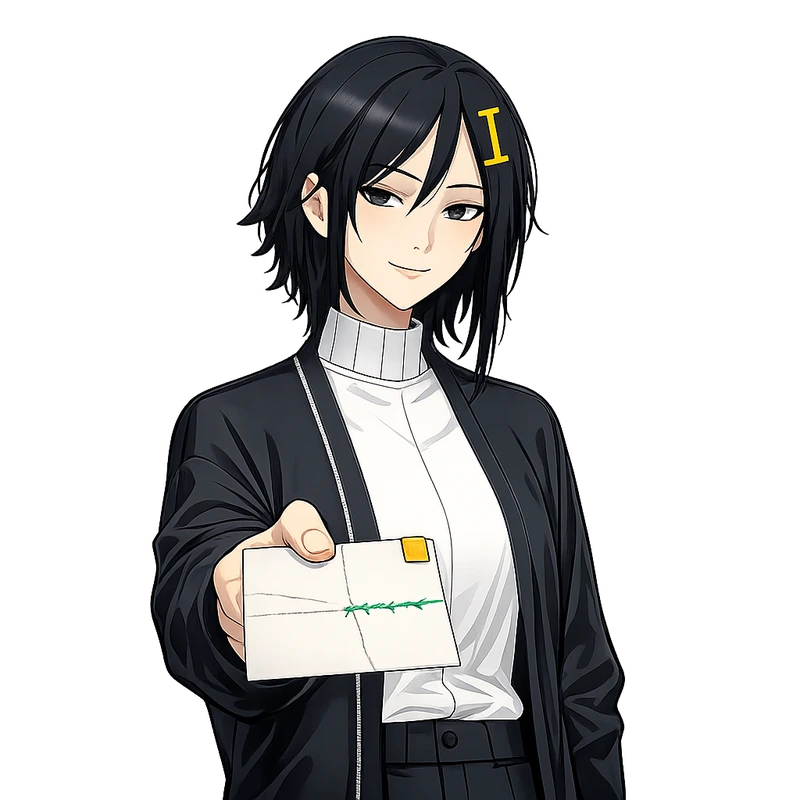

재생성본(`_remake`) 채택. 카드 주름 위로 emerald 스티치가 또렷하게 보이고 amber 탭도 함께 있음. 투명 배경·정사각형 확인됨.

---

## 6. answer-wrong

**파일명**: `mori_answer-wrong.webp` · **저장 경로**: `images/states/mori_answer-wrong.webp`

### 설명

오답 상태. 미소가 사라지고 구겨진 카드 가장자리를 잡는다. 강조색 rose.

### 프롬프트

```text
Edit the attached locked MORI portrait. This is a masked production edit, not a new illustration — do not regenerate the whole image. Preserve all unmasked pixels exactly as they are, including the background, the hairpin shape and color, and every clothing detail. Keep the exact face landmarks, head angle, hair silhouette, the hairpin's exact shape and position as shown in the reference, clothing outline, line art, palette, crop, canvas size, framing, and lighting identical to the reference — do not reframe, rotate, zoom, or resize. The reference is a square 1:1 canvas; the output must stay square 1:1 too, never a tall 2:3 portrait. Change only the requested expression, hand gesture, and the single prop described below, and nothing else. Do not add new details, accessories, or polish beyond the reference.

Her smile disappears. Her eyes look quietly hurt rather than angry. One hand grips the creased edge of a card with a single rose correction stroke.

Background: the reference image has a true transparent background (a real alpha channel). Preserve it exactly — every background pixel stays transparent alpha, with nothing rendered behind her. This has no fallback color: not black, not gray, not white, not a gradient, not a vignette, not a spotlight, not a floor, not a shadow, not a reflection. No text, logo, UI, or scenery either.

STRICT REQUIREMENTS — do not violate any of these:
- Background MUST be true transparent alpha, identical to the reference. No fallback solid color of any kind — not black, not gray, not white.
- Hairpin copied pixel-for-pixel from the reference: same shape, size, color, and position. Do not redesign it into a different shape.
- Canvas stays square 1:1, identical size to the reference — never reverts to a tall 2:3 portrait.
- Only the described expression, hand gesture, and single prop change. Every other pixel — face, hair, clothing, stitch, pocket, crop — stays identical to the reference.
- No reframing, rotation, zoom, or canvas resize.

Avoid: generic cyberpunk girl, neon circuit hoodie, hologram, tactical straps, school uniform, childlike body, huge glossy eyes, plastic skin, airbrushed face, photorealism, 3D render, painterly splash art, excessive hair strands, excessive clothing folds, rim light, bloom, random jewelry, multiple hair clips, double-bar hairpin, two parallel bars, barrette, symmetric hairpin, mirrored stitch, duplicated stitch, two-sided accessory, asymmetrical accessory changes, unreadable text, pseudo-lettering, logo, watermark, background scene, vignette, radial glow background, gradient backdrop, spotlight, drop shadow, cast shadow, contact shadow, floor plane, reflection, black background, pure black backdrop, near-black backdrop, white background, gray background, solid color background, opaque background, colored backdrop, flat color background, tall portrait canvas, 2:3 aspect ratio, non-square canvas, cropped feet, extra fingers, merged fingers, broken hands, duplicate props.
```

첨부: 1번 observing 흉상.

### 이미지

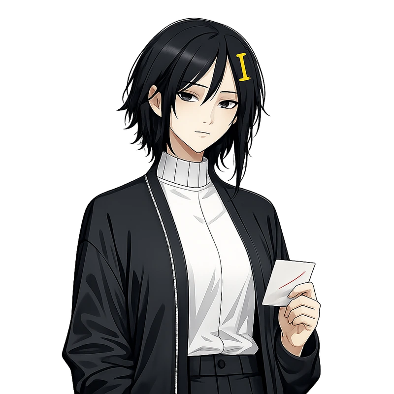

투명 배경·정사각형 확인됨. 웃음 사라짐, rose 사선 자국 카드, 설계와 일치.

---

## 7. deep-verify

**파일명**: `mori_deep-verify.webp` · **저장 경로**: `images/states/mori_deep-verify.webp`

### 설명

`DEEP VERIFY` 활성 상태. 플레이어를 똑바로 보며 amber 탭 카드 한 장을 내미는 도발적인 반쪽 미소. 강조색 amber + rose.

### 프롬프트

```text
Edit the attached locked MORI portrait. This is a masked production edit, not a new illustration — do not regenerate the whole image. Preserve all unmasked pixels exactly as they are, including the background, the hairpin shape and color, and every clothing detail. Keep the exact face landmarks, head angle, hair silhouette, the hairpin's exact shape and position as shown in the reference, clothing outline, line art, palette, crop, canvas size, framing, and lighting identical to the reference — do not reframe, rotate, zoom, or resize. The reference is a square 1:1 canvas; the output must stay square 1:1 too, never a tall 2:3 portrait. Change only the requested expression, hand gesture, and the single prop described below, and nothing else. Do not add new details, accessories, or polish beyond the reference.

She meets the viewer's eyes with a restrained, challenging half-smile and offers one blank index card with a single amber edge tab. Her other hand stays out of frame. Add one short rose correction stroke near the card edge, no text or extra symbol.

Background: the reference image has a true transparent background (a real alpha channel). Preserve it exactly — every background pixel stays transparent alpha, with nothing rendered behind her. This has no fallback color: not black, not gray, not white, not a gradient, not a vignette, not a spotlight, not a floor, not a shadow, not a reflection. No text, logo, UI, or scenery either.

STRICT REQUIREMENTS — do not violate any of these:
- Background MUST be true transparent alpha, identical to the reference. No fallback solid color of any kind — not black, not gray, not white.
- Hairpin copied pixel-for-pixel from the reference: same shape, size, color, and position. Do not redesign it into a different shape.
- Canvas stays square 1:1, identical size to the reference — never reverts to a tall 2:3 portrait.
- Only the described expression, hand gesture, and single prop change. Every other pixel — face, hair, clothing, stitch, pocket, crop — stays identical to the reference.
- No reframing, rotation, zoom, or canvas resize.

Avoid: generic cyberpunk girl, neon circuit hoodie, hologram, tactical straps, school uniform, childlike body, huge glossy eyes, plastic skin, airbrushed face, photorealism, 3D render, painterly splash art, excessive hair strands, excessive clothing folds, rim light, bloom, random jewelry, multiple hair clips, double-bar hairpin, two parallel bars, barrette, symmetric hairpin, mirrored stitch, duplicated stitch, two-sided accessory, asymmetrical accessory changes, unreadable text, pseudo-lettering, logo, watermark, background scene, vignette, radial glow background, gradient backdrop, spotlight, drop shadow, cast shadow, contact shadow, floor plane, reflection, black background, pure black backdrop, near-black backdrop, white background, gray background, solid color background, opaque background, colored backdrop, flat color background, tall portrait canvas, 2:3 aspect ratio, non-square canvas, cropped feet, extra fingers, merged fingers, broken hands, duplicate props.
```

첨부: 1번 observing 흉상.

### 이미지

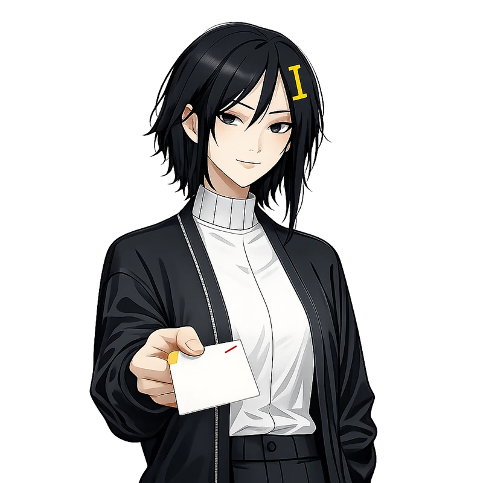

투명 배경·정사각형 확인됨. amber 탭 + rose 선 카드, 도발적인 미소, 설계와 일치.

---

## 8. time-critical

**파일명**: `mori_time-critical.webp` · **저장 경로**: `images/states/mori_time-critical.webp`

### 설명

5초 이하 상태. 시선이 날카로워지고 rose 연필을 선택지 쪽으로 겨눈다. 강조색 rose.

### 프롬프트

```text
Edit the attached locked MORI portrait. This is a masked production edit, not a new illustration — do not regenerate the whole image. Preserve all unmasked pixels exactly as they are, including the background, the hairpin shape and color, and every clothing detail. Keep the exact face landmarks, head angle, hair silhouette, the hairpin's exact shape and position as shown in the reference, clothing outline, line art, palette, crop, canvas size, framing, and lighting identical to the reference — do not reframe, rotate, zoom, or resize. The reference is a square 1:1 canvas; the output must stay square 1:1 too, never a tall 2:3 portrait. Change only the requested expression, hand gesture, and the single prop described below, and nothing else. Do not add new details, accessories, or polish beyond the reference.

Her eyes sharpen and her posture leans forward by only a few degrees. She points the rose correction pencil toward the unseen choices with controlled urgency, not panic.

Background: the reference image has a true transparent background (a real alpha channel). Preserve it exactly — every background pixel stays transparent alpha, with nothing rendered behind her. This has no fallback color: not black, not gray, not white, not a gradient, not a vignette, not a spotlight, not a floor, not a shadow, not a reflection. No text, logo, UI, or scenery either.

STRICT REQUIREMENTS — do not violate any of these:
- Background MUST be true transparent alpha, identical to the reference. No fallback solid color of any kind — not black, not gray, not white.
- Hairpin copied pixel-for-pixel from the reference: same shape, size, color, and position. Do not redesign it into a different shape.
- Canvas stays square 1:1, identical size to the reference — never reverts to a tall 2:3 portrait.
- Only the described expression, hand gesture, and single prop change. Every other pixel — face, hair, clothing, stitch, pocket, crop — stays identical to the reference.
- No reframing, rotation, zoom, or canvas resize.

Avoid: generic cyberpunk girl, neon circuit hoodie, hologram, tactical straps, school uniform, childlike body, huge glossy eyes, plastic skin, airbrushed face, photorealism, 3D render, painterly splash art, excessive hair strands, excessive clothing folds, rim light, bloom, random jewelry, multiple hair clips, double-bar hairpin, two parallel bars, barrette, symmetric hairpin, mirrored stitch, duplicated stitch, two-sided accessory, asymmetrical accessory changes, unreadable text, pseudo-lettering, logo, watermark, background scene, vignette, radial glow background, gradient backdrop, spotlight, drop shadow, cast shadow, contact shadow, floor plane, reflection, black background, pure black backdrop, near-black backdrop, white background, gray background, solid color background, opaque background, colored backdrop, flat color background, tall portrait canvas, 2:3 aspect ratio, non-square canvas, cropped feet, extra fingers, merged fingers, broken hands, duplicate props.
```

첨부: 1번 observing 흉상.

### 이미지

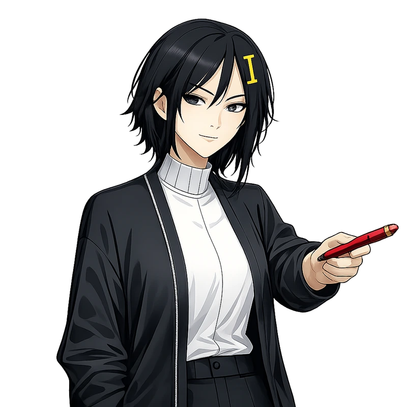

투명 배경·정사각형 확인됨. 연필을 겨누는 포즈는 맞는데, 설계는 "날카로워진 눈, 통제된 긴박감"인데 표정이 미소에 가까움. 다른 상태들과 표정 차이가 옅어질 수 있어 참고.

---

## 9. core-final

**파일명**: `mori_core-final.webp` · **저장 경로**: `images/states/mori_core-final.webp`

### 설명

마지막 6라운드 진입 상태. 플레이어와 정면으로 시선을 맞추고 봉인 직전의 일지 카드를 함께 붙든다. 강조색 amber + rose.

### 프롬프트

```text
Edit the attached locked MORI portrait. This is a masked production edit, not a new illustration — do not regenerate the whole image. Preserve all unmasked pixels exactly as they are, including the background, the hairpin shape and color, and every clothing detail. Keep the exact face landmarks, head angle, hair silhouette, the hairpin's exact shape and position as shown in the reference, clothing outline, line art, palette, crop, canvas size, framing, and lighting identical to the reference — do not reframe, rotate, zoom, or resize. The reference is a square 1:1 canvas; the output must stay square 1:1 too, never a tall 2:3 portrait. Change only the requested expression, hand gesture, and the single prop described below, and nothing else. Do not add new details, accessories, or polish beyond the reference.

She meets the viewer's eyes with calm concentration and leans forward by only a few degrees. Both hands hold the opposite edges of one charcoal archive card as if she and the viewer are about to seal it together. Add one amber edge tab and one short rose correction line, with no writing or extra symbol.

Background: the reference image has a true transparent background (a real alpha channel). Preserve it exactly — every background pixel stays transparent alpha, with nothing rendered behind her. This has no fallback color: not black, not gray, not white, not a gradient, not a vignette, not a spotlight, not a floor, not a shadow, not a reflection. No text, logo, UI, or scenery either.

STRICT REQUIREMENTS — do not violate any of these:
- Background MUST be true transparent alpha, identical to the reference. No fallback solid color of any kind — not black, not gray, not white.
- Hairpin copied pixel-for-pixel from the reference: same shape, size, color, and position. Do not redesign it into a different shape.
- Canvas stays square 1:1, identical size to the reference — never reverts to a tall 2:3 portrait.
- Only the described expression, hand gesture, and single prop change. Every other pixel — face, hair, clothing, stitch, pocket, crop — stays identical to the reference.
- No reframing, rotation, zoom, or canvas resize.

Avoid: generic cyberpunk girl, neon circuit hoodie, hologram, tactical straps, school uniform, childlike body, huge glossy eyes, plastic skin, airbrushed face, photorealism, 3D render, painterly splash art, excessive hair strands, excessive clothing folds, rim light, bloom, random jewelry, multiple hair clips, double-bar hairpin, two parallel bars, barrette, symmetric hairpin, mirrored stitch, duplicated stitch, two-sided accessory, asymmetrical accessory changes, unreadable text, pseudo-lettering, logo, watermark, background scene, vignette, radial glow background, gradient backdrop, spotlight, drop shadow, cast shadow, contact shadow, floor plane, reflection, black background, pure black backdrop, near-black backdrop, white background, gray background, solid color background, opaque background, colored backdrop, flat color background, tall portrait canvas, 2:3 aspect ratio, non-square canvas, cropped feet, extra fingers, merged fingers, broken hands, duplicate props.
```

첨부: 1번 observing 흉상.

### 이미지

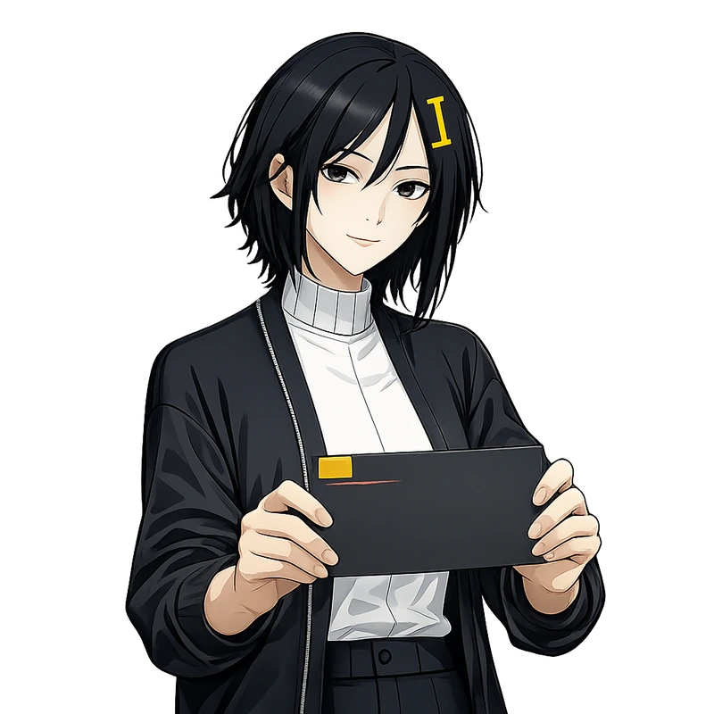

투명 배경·정사각형 확인됨. 양손으로 카드를 붙든 구도, 설계와 일치.

---

## 10. result-verified

**파일명**: `mori_result-verified.webp` · **저장 경로**: `images/states/mori_result-verified.webp`

### 설명

검증 결말 상태. 긴장이 풀린 미소로 기억 조각을 카드 포켓에 보관한다. 강조색 emerald.

### 프롬프트

```text
Edit the attached locked MORI portrait. This is a masked production edit, not a new illustration — do not regenerate the whole image. Preserve all unmasked pixels exactly as they are, including the background, the hairpin shape and color, and every clothing detail. Keep the exact face landmarks, head angle, hair silhouette, the hairpin's exact shape and position as shown in the reference, clothing outline, line art, palette, crop, canvas size, framing, and lighting identical to the reference — do not reframe, rotate, zoom, or resize. The reference is a square 1:1 canvas; the output must stay square 1:1 too, never a tall 2:3 portrait. Change only the requested expression, hand gesture, and the single prop described below, and nothing else. Do not add new details, accessories, or polish beyond the reference.

Her shoulders soften and she gives a small genuine smile. She places one cyan translucent memory shard into the archive pocket.

Background: the reference image has a true transparent background (a real alpha channel). Preserve it exactly — every background pixel stays transparent alpha, with nothing rendered behind her. This has no fallback color: not black, not gray, not white, not a gradient, not a vignette, not a spotlight, not a floor, not a shadow, not a reflection. No text, logo, UI, or scenery either.

STRICT REQUIREMENTS — do not violate any of these:
- Background MUST be true transparent alpha, identical to the reference. No fallback solid color of any kind — not black, not gray, not white.
- Hairpin copied pixel-for-pixel from the reference: same shape, size, color, and position. Do not redesign it into a different shape.
- Canvas stays square 1:1, identical size to the reference — never reverts to a tall 2:3 portrait.
- Only the described expression, hand gesture, and single prop change. Every other pixel — face, hair, clothing, stitch, pocket, crop — stays identical to the reference.
- No reframing, rotation, zoom, or canvas resize.

Avoid: generic cyberpunk girl, neon circuit hoodie, hologram, tactical straps, school uniform, childlike body, huge glossy eyes, plastic skin, airbrushed face, photorealism, 3D render, painterly splash art, excessive hair strands, excessive clothing folds, rim light, bloom, random jewelry, multiple hair clips, double-bar hairpin, two parallel bars, barrette, symmetric hairpin, mirrored stitch, duplicated stitch, two-sided accessory, asymmetrical accessory changes, unreadable text, pseudo-lettering, logo, watermark, background scene, vignette, radial glow background, gradient backdrop, spotlight, drop shadow, cast shadow, contact shadow, floor plane, reflection, black background, pure black backdrop, near-black backdrop, white background, gray background, solid color background, opaque background, colored backdrop, flat color background, tall portrait canvas, 2:3 aspect ratio, non-square canvas, cropped feet, extra fingers, merged fingers, broken hands, duplicate props.
```

첨부: 1번 observing 흉상.

### 이미지

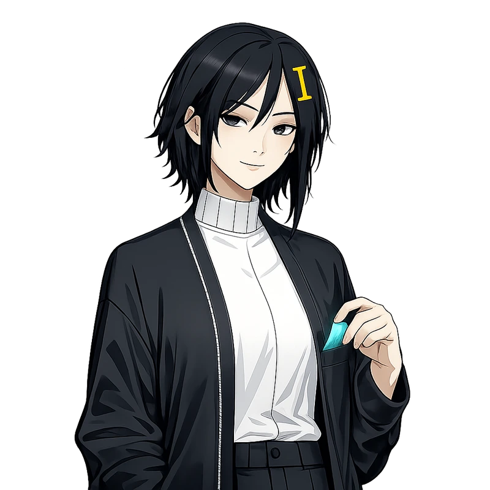

투명 배경·정사각형 확인됨. cyan 조각을 포켓에 넣는 손짓, 부드러운 미소, 설계와 정확히 일치.

---

## 11. result-unstable

**파일명**: `mori_result-unstable.webp` · **저장 경로**: `images/states/mori_result-unstable.webp`

### 설명

불안정 결말 상태. 피곤한 눈에 rose 연필 자국이 묻은 카드. 강조색 rose.

### 프롬프트

```text
Edit the attached locked MORI portrait. This is a masked production edit, not a new illustration — do not regenerate the whole image. Preserve all unmasked pixels exactly as they are, including the background, the hairpin shape and color, and every clothing detail. Keep the exact face landmarks, head angle, hair silhouette, the hairpin's exact shape and position as shown in the reference, clothing outline, line art, palette, crop, canvas size, framing, and lighting identical to the reference — do not reframe, rotate, zoom, or resize. The reference is a square 1:1 canvas; the output must stay square 1:1 too, never a tall 2:3 portrait. Change only the requested expression, hand gesture, and the single prop described below, and nothing else. Do not add new details, accessories, or polish beyond the reference.

She looks tired and disappointed, not monstrous. Her eyes clearly show tiredness: heavier eyelids, a faint dark shadow underneath, a duller and less alert gaze than the reference — this eye change is mandatory and must be clearly visible, not subtle. A small rose pencil smudge appears on one card. One single strand of hair has come loose from the rest and visibly drapes across her cheek or jawline, clearly diverging from the hairstyle's silhouette — this one stray strand is a deliberate, required exception to "excessive hair strands" below; it must still be added even though extra hair strands are otherwise discouraged.

Background: the reference image has a true transparent background (a real alpha channel). Preserve it exactly — every background pixel stays transparent alpha, with nothing rendered behind her. This has no fallback color: not black, not gray, not white, not a gradient, not a vignette, not a spotlight, not a floor, not a shadow, not a reflection. No text, logo, UI, or scenery either.

STRICT REQUIREMENTS — do not violate any of these:
- The tired eyes (heavier eyelids, under-eye shadow, duller gaze) AND the one loose hair strand across her cheek/jawline are the two defining elements of this image. Both must be clearly visible. An image that only shows a serious expression with a marked card, but no tired eyes and no stray hair strand, is a failed generation — it will look identical to answer-wrong and must be regenerated.
- Background MUST be true transparent alpha, identical to the reference. No fallback solid color of any kind — not black, not gray, not white.
- Hairpin copied pixel-for-pixel from the reference: same shape, size, color, and position. Do not redesign it into a different shape.
- Canvas stays square 1:1, identical size to the reference — never reverts to a tall 2:3 portrait.
- Only the described expression, hand gesture, single prop, and the one loose hair strand may change. Every other pixel — face structure, hair silhouette, clothing, stitch, pocket, crop — stays identical to the reference.
- No reframing, rotation, zoom, or canvas resize.

Avoid: generic cyberpunk girl, neon circuit hoodie, hologram, tactical straps, school uniform, childlike body, huge glossy eyes, plastic skin, airbrushed face, photorealism, 3D render, painterly splash art, many loose hair strands, messy hair, excessive clothing folds, rim light, bloom, random jewelry, multiple hair clips, double-bar hairpin, two parallel bars, barrette, symmetric hairpin, mirrored stitch, duplicated stitch, two-sided accessory, asymmetrical accessory changes, unreadable text, pseudo-lettering, logo, watermark, background scene, vignette, radial glow background, gradient backdrop, spotlight, drop shadow, cast shadow, contact shadow, floor plane, reflection, black background, pure black backdrop, near-black backdrop, white background, gray background, solid color background, opaque background, colored backdrop, flat color background, tall portrait canvas, 2:3 aspect ratio, non-square canvas, alert unchanged eyes, missing tired expression, no loose hair strand, cropped feet, extra fingers, merged fingers, broken hands, duplicate props.
```

첨부: 1번 observing 흉상.

### 이미지

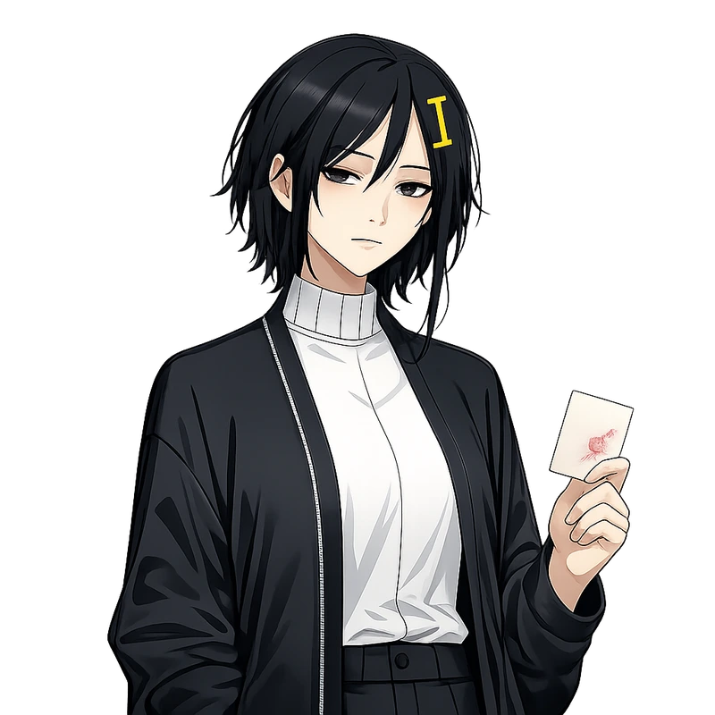

재생성본(`_remake`) 채택. 눈매가 확실히 무겁고 흐릿해져서 6번 answer-wrong과는 표정으로 구분됨, 카드의 rose 얼룩도 자연스러움. 다만 뺨을 가로지르는 잔머리 한 가닥은 기존 헤어 실루엣(원래도 얼굴 옆으로 긴 머리 한 갈래가 있음)과 뚜렷이 구분되지는 않음 — 크게 문제되지 않는다고 판단해 채택. 투명 배경·정사각형 확인됨.

---

## 12. boot-empty

**파일명**: `mori_boot-empty.webp` · **저장 경로**: `images/states/mori_boot-empty.webp`

### 설명

첫 방문, 기억 없음 상태. 빈 카드를 내려다보다 플레이어를 발견한 호기심. 강조색 cyan.

### 프롬프트

```text
Edit the attached locked MORI portrait. This is a masked production edit, not a new illustration — do not regenerate the whole image. Preserve all unmasked pixels exactly as they are, including the background, the hairpin shape and color, and every clothing detail. Keep the exact face landmarks, head angle, hair silhouette, the hairpin's exact shape and position as shown in the reference, clothing outline, line art, palette, crop, canvas size, framing, and lighting identical to the reference — do not reframe, rotate, zoom, or resize. The reference is a square 1:1 canvas; the output must stay square 1:1 too, never a tall 2:3 portrait. Change only the requested expression, hand gesture, and the single prop described below, and nothing else. Do not add new details, accessories, or polish beyond the reference.

She looks down at one completely blank index card, then raises her eyes toward the viewer with cautious curiosity. Her shoulders remain open and relaxed.

Background: the reference image has a true transparent background (a real alpha channel). Preserve it exactly — every background pixel stays transparent alpha, with nothing rendered behind her. This has no fallback color: not black, not gray, not white, not a gradient, not a vignette, not a spotlight, not a floor, not a shadow, not a reflection. No text, logo, UI, or scenery either.

STRICT REQUIREMENTS — do not violate any of these:
- The index card must be completely blank — no check mark, no stitch, no amber tab, no rose mark, no mark of any kind. A card carrying any mark copied over from another state is a failed generation.
- Background MUST be true transparent alpha, identical to the reference. No fallback solid color of any kind — not black, not gray, not white.
- Hairpin copied pixel-for-pixel from the reference: same shape, size, color, and position. Do not redesign it into a different shape.
- Canvas stays square 1:1, identical size to the reference — never reverts to a tall 2:3 portrait.
- Only the described expression, hand gesture, and single prop change. Every other pixel — face, hair, clothing, stitch, pocket, crop — stays identical to the reference.
- No reframing, rotation, zoom, or canvas resize.

Avoid: generic cyberpunk girl, neon circuit hoodie, hologram, tactical straps, school uniform, childlike body, huge glossy eyes, plastic skin, airbrushed face, photorealism, 3D render, painterly splash art, excessive hair strands, excessive clothing folds, rim light, bloom, random jewelry, multiple hair clips, double-bar hairpin, two parallel bars, barrette, symmetric hairpin, mirrored stitch, duplicated stitch, two-sided accessory, asymmetrical accessory changes, unreadable text, pseudo-lettering, logo, watermark, background scene, vignette, radial glow background, gradient backdrop, spotlight, drop shadow, cast shadow, contact shadow, floor plane, reflection, black background, pure black backdrop, near-black backdrop, white background, gray background, solid color background, opaque background, colored backdrop, flat color background, tall portrait canvas, 2:3 aspect ratio, non-square canvas, check mark on card, stitch on card, amber tab on card, rose mark on card, marked card, cropped feet, extra fingers, merged fingers, broken hands, duplicate props.
```

첨부: 1번 observing 흉상.

### 이미지

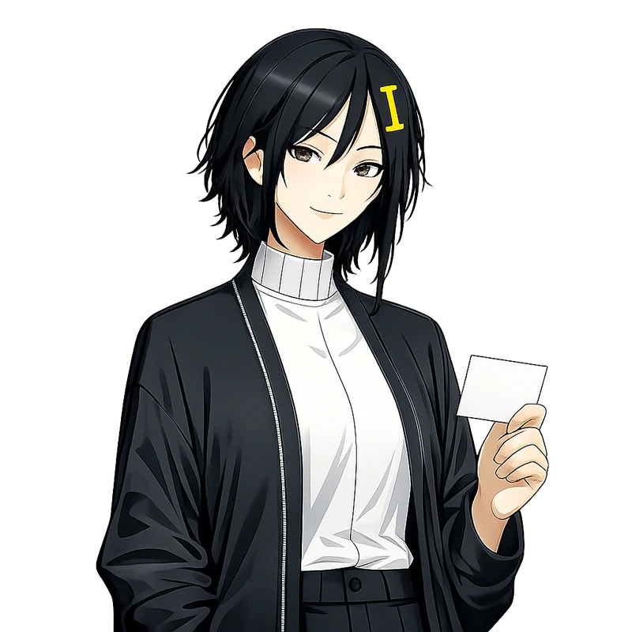

투명 배경·정사각형 확인됨. 완전히 빈 카드, 호기심 어린 표정으로 설계와 일치.

---

## 13. return-found

**파일명**: `mori_return-found.webp` · **저장 경로**: `images/states/mori_return-found.webp`

### 설명

재방문 상태. 이미 알고 있다는 작은 옆미소, 카드 모서리를 두드림. 강조색 amber.

### 프롬프트

```text
Edit the attached locked MORI portrait. This is a masked production edit, not a new illustration — do not regenerate the whole image. Preserve all unmasked pixels exactly as they are, including the background, the hairpin shape and color, and every clothing detail. Keep the exact face landmarks, head angle, hair silhouette, the hairpin's exact shape and position as shown in the reference, clothing outline, line art, palette, crop, canvas size, framing, and lighting identical to the reference — do not reframe, rotate, zoom, or resize. The reference is a square 1:1 canvas; the output must stay square 1:1 too, never a tall 2:3 portrait. Change only the requested expression, hand gesture, and the single prop described below, and nothing else. Do not add new details, accessories, or polish beyond the reference.

She recognizes the viewer. Add a restrained knowing half-smile and have one fingertip tap the corner of an index card with three simple tally notches, not text.

Background: the reference image has a true transparent background (a real alpha channel). Preserve it exactly — every background pixel stays transparent alpha, with nothing rendered behind her. This has no fallback color: not black, not gray, not white, not a gradient, not a vignette, not a spotlight, not a floor, not a shadow, not a reflection. No text, logo, UI, or scenery either.

STRICT REQUIREMENTS — do not violate any of these:
- The three tally notches on the card's corner are the defining element: simple short parallel marks like "| | |", clearly visible and countable as exactly three. Not letters, not numbers, not a blank card, not more or fewer than three notches.
- Background MUST be true transparent alpha, identical to the reference. No fallback solid color of any kind — not black, not gray, not white.
- Hairpin copied pixel-for-pixel from the reference: same shape, size, color, and position. Do not redesign it into a different shape.
- Canvas stays square 1:1, identical size to the reference — never reverts to a tall 2:3 portrait.
- Only the described expression, hand gesture, and single prop change. Every other pixel — face, hair, clothing, stitch, pocket, crop — stays identical to the reference.
- No reframing, rotation, zoom, or canvas resize.

Avoid: generic cyberpunk girl, neon circuit hoodie, hologram, tactical straps, school uniform, childlike body, huge glossy eyes, plastic skin, airbrushed face, photorealism, 3D render, painterly splash art, excessive hair strands, excessive clothing folds, rim light, bloom, random jewelry, multiple hair clips, double-bar hairpin, two parallel bars, barrette, symmetric hairpin, mirrored stitch, duplicated stitch, two-sided accessory, asymmetrical accessory changes, readable text on card, pseudo-lettering, numbers on card, logo, watermark, background scene, vignette, radial glow background, gradient backdrop, spotlight, drop shadow, cast shadow, contact shadow, floor plane, reflection, black background, pure black backdrop, near-black backdrop, white background, gray background, solid color background, opaque background, colored backdrop, flat color background, tall portrait canvas, 2:3 aspect ratio, non-square canvas, blank card with no notches, single notch, more than three notches, cropped feet, extra fingers, merged fingers, broken hands, duplicate props.
```

첨부: 1번 observing 흉상.

### 이미지

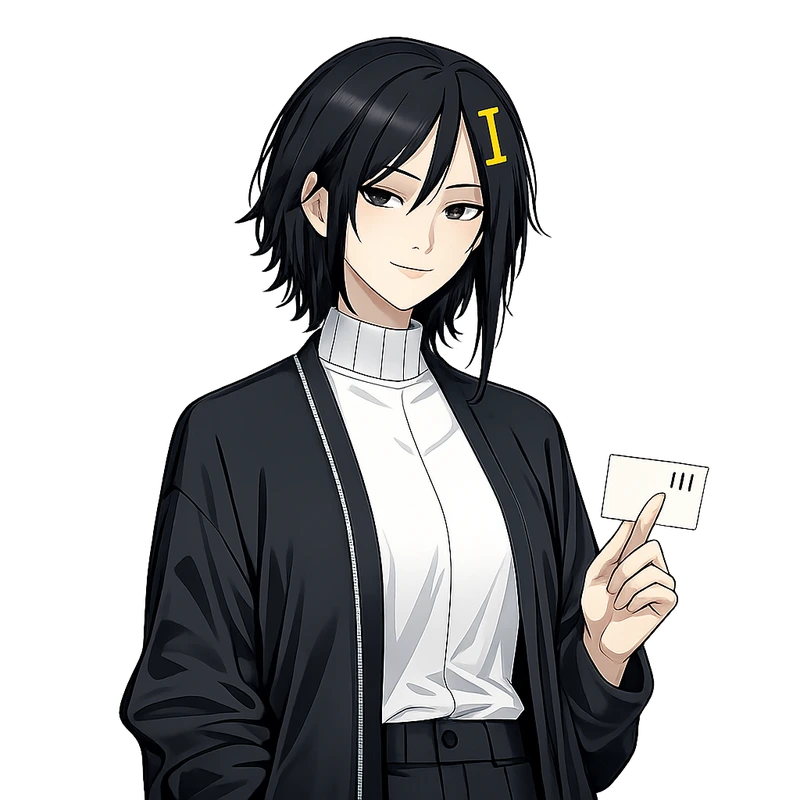

투명 배경·정사각형 확인됨. 카드에 "III" 세 개의 탤리 표시가 정확히 나왔고, 손가락으로 두드리는 제스처와 아는 듯한 미소까지 설계와 정확히 일치.

---

## 14. lens-used

**파일명**: `mori_lens-used.webp` · **저장 경로**: `images/states/mori_lens-used.webp`

### 설명

ARCHIVE LENS 사용 상태. 잘라낸 거짓 카드 한 장을 옆으로 치움. 강조색 amber.

### 프롬프트

```text
Edit the attached locked MORI portrait. This is a masked production edit, not a new illustration — do not regenerate the whole image. Preserve all unmasked pixels exactly as they are, including the background, the hairpin shape and color, and every clothing detail. Keep the exact face landmarks, head angle, hair silhouette, the hairpin's exact shape and position as shown in the reference, clothing outline, line art, palette, crop, canvas size, framing, and lighting identical to the reference — do not reframe, rotate, zoom, or resize. The reference is a square 1:1 canvas; the output must stay square 1:1 too, never a tall 2:3 portrait. Change only the requested expression, hand gesture, and the single prop described below, and nothing else. Do not add new details, accessories, or polish beyond the reference.

She calmly moves one rejected blank card out of the working stack with two fingers. A single amber (#FCD34D) diagonal retention mark appears on that card; no text or extra symbol.

Background: the reference image has a true transparent background (a real alpha channel). Preserve it exactly — every background pixel stays transparent alpha, with nothing rendered behind her. This has no fallback color: not black, not gray, not white, not a gradient, not a vignette, not a spotlight, not a floor, not a shadow, not a reflection. No text, logo, UI, or scenery either.

STRICT REQUIREMENTS — do not violate any of these:
- The single amber (#FCD34D) diagonal mark on the card is the defining element and must be clearly visible and unmistakably diagonal — not a checkmark, not a horizontal or vertical line, not omitted.
- Background MUST be true transparent alpha, identical to the reference. No fallback solid color of any kind — not black, not gray, not white.
- Hairpin copied pixel-for-pixel from the reference: same shape, size, color, and position. Do not redesign it into a different shape.
- Canvas stays square 1:1, identical size to the reference — never reverts to a tall 2:3 portrait.
- Only the described expression, hand gesture, and single prop change. Every other pixel — face, hair, clothing, stitch, pocket, crop — stays identical to the reference.
- No reframing, rotation, zoom, or canvas resize.

Avoid: generic cyberpunk girl, neon circuit hoodie, hologram, tactical straps, school uniform, childlike body, huge glossy eyes, plastic skin, airbrushed face, photorealism, 3D render, painterly splash art, excessive hair strands, excessive clothing folds, rim light, bloom, random jewelry, multiple hair clips, double-bar hairpin, two parallel bars, barrette, symmetric hairpin, mirrored stitch, duplicated stitch, two-sided accessory, asymmetrical accessory changes, unreadable text, pseudo-lettering, logo, watermark, background scene, vignette, radial glow background, gradient backdrop, spotlight, drop shadow, cast shadow, contact shadow, floor plane, reflection, black background, pure black backdrop, near-black backdrop, white background, gray background, solid color background, opaque background, colored backdrop, flat color background, tall portrait canvas, 2:3 aspect ratio, non-square canvas, no amber mark, missing diagonal mark, amber checkmark instead of diagonal line, cropped feet, extra fingers, merged fingers, broken hands, duplicate props.
```

첨부: 1번 observing 흉상.

### 이미지

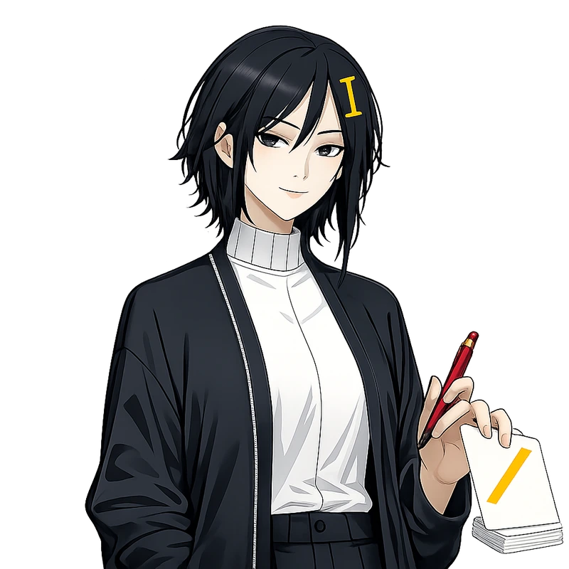

투명 배경·정사각형 확인됨. 카드의 amber 사선 마크가 뚜렷함. 다만 다른 손에 연필도 함께 들려 있어 소품이 엄밀히는 두 개인데, 핵심 판별 요소(사선 마크)가 명확해서 채택.

---

## 15. tab-left

**파일명**: `mori_tab-left.webp` · **저장 경로**: `images/states/mori_tab-left.webp`

### 설명

탭을 떠났다가 돌아온 상태. 시선을 정면에 고정, 접힌 보존 카드를 쥠. 강조색 amber + rose 소량.

### 프롬프트

```text
Edit the attached locked MORI portrait. This is a masked production edit, not a new illustration — do not regenerate the whole image. Preserve all unmasked pixels exactly as they are, including the background, the hairpin shape and color, and every clothing detail. Keep the exact face landmarks, head angle, hair silhouette, the hairpin's exact shape and position as shown in the reference, clothing outline, line art, palette, crop, canvas size, framing, and lighting identical to the reference — do not reframe, rotate, zoom, or resize. The reference is a square 1:1 canvas; the output must stay square 1:1 too, never a tall 2:3 portrait. Change only the requested expression, hand gesture, and the single prop described below, and nothing else. Do not add new details, accessories, or polish beyond the reference.

She holds eye contact without smiling, chin raised by only a few degrees. Her hand holds one folded amber (#FCD34D) retention card a little too tightly. The mood is restrained possessiveness, never horror or violence.

Background: the reference image has a true transparent background (a real alpha channel). Preserve it exactly — every background pixel stays transparent alpha, with nothing rendered behind her. This has no fallback color: not black, not gray, not white, not a gradient, not a vignette, not a spotlight, not a floor, not a shadow, not a reflection. No text, logo, UI, or scenery either.

STRICT REQUIREMENTS — do not violate any of these:
- Her expression must stay unsmiling with direct, held eye contact, and her grip on the folded card must visibly read as tense — whitened knuckles or a creased card edge. A relaxed grip or any smile is a failed generation for this state.
- Background MUST be true transparent alpha, identical to the reference. No fallback solid color of any kind — not black, not gray, not white.
- Hairpin copied pixel-for-pixel from the reference: same shape, size, color, and position. Do not redesign it into a different shape.
- Canvas stays square 1:1, identical size to the reference — never reverts to a tall 2:3 portrait.
- Only the described expression, hand gesture, and single prop change. Every other pixel — face, hair, clothing, stitch, pocket, crop — stays identical to the reference.
- No reframing, rotation, zoom, or canvas resize.

Avoid: generic cyberpunk girl, neon circuit hoodie, hologram, tactical straps, school uniform, childlike body, huge glossy eyes, plastic skin, airbrushed face, photorealism, 3D render, painterly splash art, excessive hair strands, excessive clothing folds, rim light, bloom, random jewelry, multiple hair clips, double-bar hairpin, two parallel bars, barrette, symmetric hairpin, mirrored stitch, duplicated stitch, two-sided accessory, asymmetrical accessory changes, unreadable text, pseudo-lettering, logo, watermark, background scene, vignette, radial glow background, gradient backdrop, spotlight, drop shadow, cast shadow, contact shadow, floor plane, reflection, black background, pure black backdrop, near-black backdrop, white background, gray background, solid color background, opaque background, colored backdrop, flat color background, tall portrait canvas, 2:3 aspect ratio, non-square canvas, smiling expression, relaxed grip, loose hold on card, horror expression, violence, cropped feet, extra fingers, merged fingers, broken hands, duplicate props.
```

첨부: 1번 observing 흉상.

### 이미지

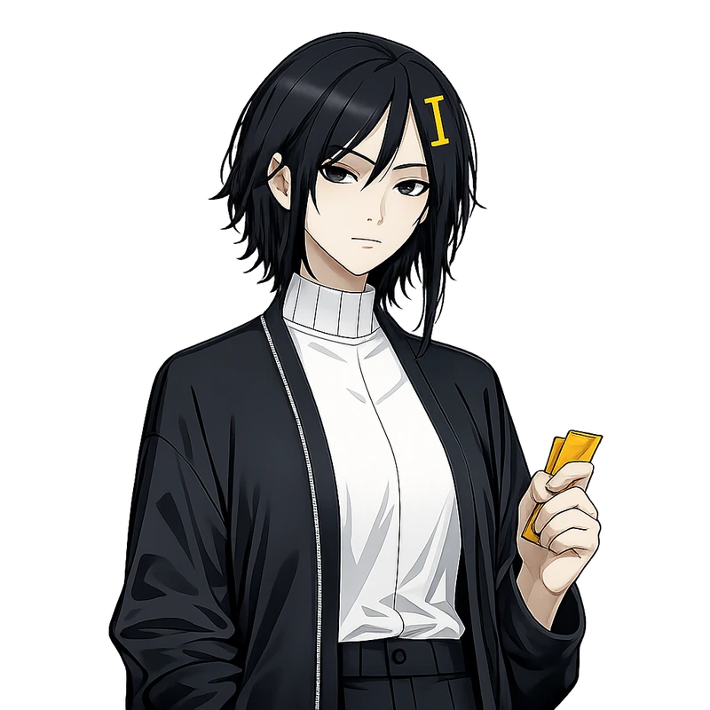

투명 배경·정사각형 확인됨. 웃지 않는 표정, 카드를 꽉 쥔 손, 정면 응시 — 설계가 요구하는 절제된 집착감과 일치.

---

## 16. other-self

**파일명**: `mori_other-self.webp` · **저장 경로**: `images/states/mori_other-self.webp`

### 설명

같은 페이지가 다른 탭에도 열린 상태. 옆을 경계하며 겹친 카드 두 장을 확인. 강조색 amber. **예외: 이 상태만 소품이 카드 두 장이다.**

### 프롬프트

```text
Edit the attached locked MORI portrait. This is a masked production edit, not a new illustration — do not regenerate the whole image. Preserve all unmasked pixels exactly as they are, including the background, the hairpin shape and color, and every clothing detail. Keep the exact face landmarks, head angle, hair silhouette, the hairpin's exact shape and position as shown in the reference, clothing outline, line art, palette, crop, canvas size, framing, and lighting identical to the reference — do not reframe, rotate, zoom, or resize. The reference is a square 1:1 canvas; the output must stay square 1:1 too, never a tall 2:3 portrait. Change only the requested expression, hand gesture, and the two-card prop described below, and nothing else — this state is a deliberate exception to the usual single-prop rule. Do not add new details, accessories, or polish beyond the reference.

Her eyes shift to the side with guarded suspicion. She compares two overlapping blank index cards. Keep her mouth closed and composed.

Background: the reference image has a true transparent background (a real alpha channel). Preserve it exactly — every background pixel stays transparent alpha, with nothing rendered behind her. This has no fallback color: not black, not gray, not white, not a gradient, not a vignette, not a spotlight, not a floor, not a shadow, not a reflection. No text, logo, UI, or scenery either.

STRICT REQUIREMENTS — do not violate any of these:
- Exactly two overlapping blank index cards must be visible in her hand — this is the one state where two props is correct, not an error. Her gaze must clearly shift to the side, away from the viewer, not toward it.
- Background MUST be true transparent alpha, identical to the reference. No fallback solid color of any kind — not black, not gray, not white.
- Hairpin copied pixel-for-pixel from the reference: same shape, size, color, and position. Do not redesign it into a different shape.
- Canvas stays square 1:1, identical size to the reference — never reverts to a tall 2:3 portrait.
- Only the described expression, hand gesture, and the two-card prop change. Every other pixel — face, hair, clothing, stitch, pocket, crop — stays identical to the reference.
- No reframing, rotation, zoom, or canvas resize.

Avoid: generic cyberpunk girl, neon circuit hoodie, hologram, tactical straps, school uniform, childlike body, huge glossy eyes, plastic skin, airbrushed face, photorealism, 3D render, painterly splash art, excessive hair strands, excessive clothing folds, rim light, bloom, random jewelry, multiple hair clips, double-bar hairpin, two parallel bars, barrette, symmetric hairpin, mirrored stitch, duplicated stitch, two-sided accessory, asymmetrical accessory changes, unreadable text, pseudo-lettering, logo, watermark, background scene, vignette, radial glow background, gradient backdrop, spotlight, drop shadow, cast shadow, contact shadow, floor plane, reflection, black background, pure black backdrop, near-black backdrop, white background, gray background, solid color background, opaque background, colored backdrop, flat color background, tall portrait canvas, 2:3 aspect ratio, non-square canvas, single card only, one card, extra third card, direct eye contact with viewer, smiling, cropped feet, extra fingers, merged fingers, broken hands, duplicate props.
```

첨부: 1번 observing 흉상.

### 이미지

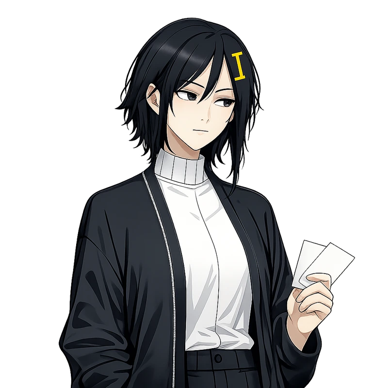

투명 배경·정사각형 확인됨. 카드 두 장이 겹쳐 있고 시선이 옆으로 경계하듯 향해 있어 설계와 정확히 일치.

---

## 17. archive-complete

**파일명**: `mori_archive-complete.webp` · **저장 경로**: `images/states/mori_archive-complete.webp`

### 설명

6조각 완성 상태. 처음으로 경계 없는 미소, 닫힌 일지를 양손에 듦. 강조색 cyan + amber. 17개 상태 중 유일하게 완전히 무장해제된 표정이 나오는 결말.

### 프롬프트

```text
Edit the attached locked MORI portrait. This is a masked production edit, not a new illustration — do not regenerate the whole image. Preserve all unmasked pixels exactly as they are, including the background, the hairpin shape and color, and every clothing detail. Keep the exact face landmarks, head angle, hair silhouette, the hairpin's exact shape and position as shown in the reference, clothing outline, line art, palette, crop, canvas size, framing, and lighting identical to the reference — do not reframe, rotate, zoom, or resize. The reference is a square 1:1 canvas; the output must stay square 1:1 too, never a tall 2:3 portrait. Change only the requested expression, hand gesture, and the single prop described below, and nothing else. Do not add new details, accessories, or polish beyond the reference.

For the first time her expression is fully unguarded but still subtle — a genuine, open smile, softer than any other state. She holds one closed charcoal archive ledger with both hands. Along its edge, stacked evenly from top to bottom, are precisely six small cyan (#67E8F9) index tabs — count them out one at a time while drawing: tab one, tab two, tab three, tab four, tab five, tab six, and stop there, no more. Also add one amber (#FCD34D) binding stitch. No writing anywhere.

Background: the reference image has a true transparent background (a real alpha channel). Preserve it exactly — every background pixel stays transparent alpha, with nothing rendered behind her. This has no fallback color: not black, not gray, not white, not a gradient, not a vignette, not a spotlight, not a floor, not a shadow, not a reflection. No text, logo, UI, or scenery either.

STRICT REQUIREMENTS — do not violate any of these:
- The cyan tab count is exactly six — not five, not seven. Before finalizing, recount the tabs along the ledger's edge one by one; if the count is not exactly six, redraw them until it is. This count is tied to real game logic (6 memory fragments) and must be exact, plus one amber (#FCD34D) binding stitch clearly visible. Fewer or more than six tabs, or a missing amber stitch, is a failed generation.
- Both hands must be visible holding the ledger.
- Background MUST be true transparent alpha, identical to the reference. No fallback solid color of any kind — not black, not gray, not white.
- Hairpin copied pixel-for-pixel from the reference: same shape, size, color, and position. Do not redesign it into a different shape.
- Canvas stays square 1:1, identical size to the reference — never reverts to a tall 2:3 portrait.
- Only the described expression, hand gesture, and single prop change. Every other pixel — face, hair, clothing, stitch, pocket, crop — stays identical to the reference.
- No reframing, rotation, zoom, or canvas resize.

Avoid: generic cyberpunk girl, neon circuit hoodie, hologram, tactical straps, school uniform, childlike body, huge glossy eyes, plastic skin, airbrushed face, photorealism, 3D render, painterly splash art, excessive hair strands, excessive clothing folds, rim light, bloom, random jewelry, multiple hair clips, double-bar hairpin, two parallel bars, barrette, symmetric hairpin, mirrored stitch, duplicated stitch, two-sided accessory, asymmetrical accessory changes, unreadable text, pseudo-lettering, logo, watermark, background scene, vignette, radial glow background, gradient backdrop, spotlight, drop shadow, cast shadow, contact shadow, floor plane, reflection, black background, pure black backdrop, near-black backdrop, white background, gray background, solid color background, opaque background, colored backdrop, flat color background, tall portrait canvas, 2:3 aspect ratio, non-square canvas, wrong tab count, five tabs, seven tabs, four tabs, missing amber stitch, one hand only, restrained half-smile, cropped feet, extra fingers, merged fingers, broken hands, duplicate props.
```

첨부: 1번 observing 흉상.

### 이미지


재생성본(`_remake`) 채택. 확대해서 세어보니 cyan 탭 정확히 6개, amber 스티치, 양손, 무장해제된 미소까지 설계와 정확히 일치. 투명 배경·정사각형 확인됨.

---

## 공통 네거티브 프롬프트

각 항목의 프롬프트 코드블록 안에 이미 `Avoid: ...`로 삽입돼 있다. 따로 복사해 넣을 필요는 없고, 아래는 전체 목록을 한눈에 보거나 나중에 항목을 수정할 때 참고하는 원본이다. 이 목록을 고치면 위 각 항목의 `Avoid:` 줄도 같이 갱신해야 한다.

```text
generic cyberpunk girl, neon circuit hoodie, hologram, tactical straps, school uniform, childlike body, huge glossy eyes, plastic skin, airbrushed face, photorealism, 3D render, painterly splash art, excessive hair strands, excessive clothing folds, rim light, bloom, random jewelry, multiple hair clips, double-bar hairpin, two parallel bars, barrette, symmetric hairpin, mirrored stitch, duplicated stitch, two-sided accessory, asymmetrical accessory changes, unreadable text, pseudo-lettering, logo, watermark, background scene, vignette, radial glow background, gradient backdrop, spotlight, drop shadow, cast shadow, contact shadow, floor plane, reflection, black background, pure black backdrop, near-black backdrop, white background, gray background, solid color background, opaque background, colored backdrop, flat color background, tall portrait canvas, 2:3 aspect ratio, non-square canvas, cropped feet, extra fingers, merged fingers, broken hands, duplicate props
```

참고: 이제 배경은 투명 알파만 허용한다. 이전에는 "균일한 단색이면 됨"이라고 열어뒀지만, 검정 배경이 나와서 머리카락과 대비가 없는 문제가 생겨 그 예외를 없앴다. 어떤 색이든 단색 배경이 나오면 네거티브 위반으로 보고 재생성한다.

12~17번(2차분)도 이 네거티브를 그대로 쓴다. 다만 16번 `other-self`는 예외적으로 카드 두 장이 정답이므로, 그 항목 안내를 따로 참고한다.
